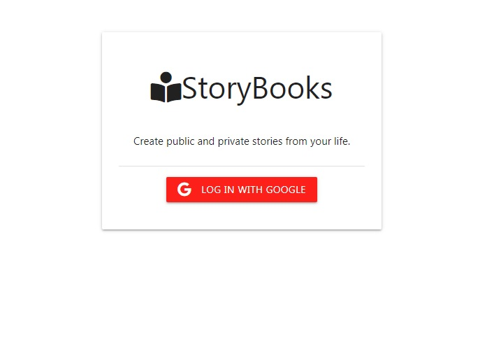
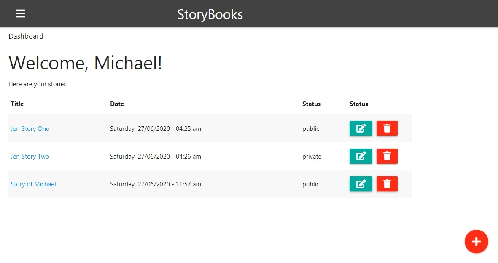
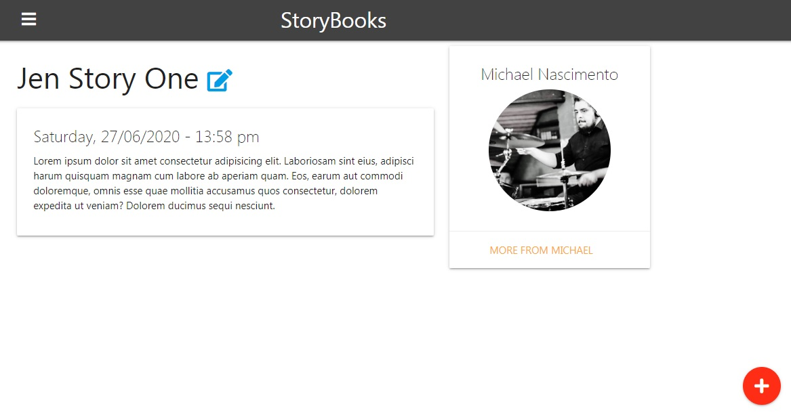
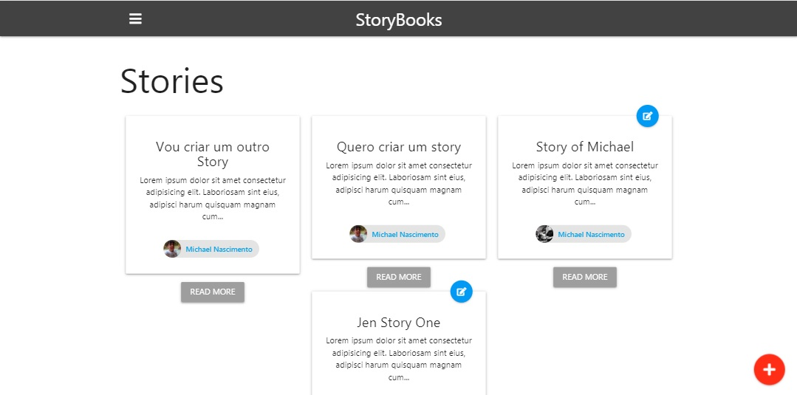

# StoryBook App #
### NodeJS / Express / MongoDB / Handlebars ###

[Clique aqui para ver a demonstração](https://storybook-michaelnsc.netlify.app/)

----

Aplicativo feito com Express e NodeJS. Usei MongoDB para persistencia de dados.

A View Engine utilizada neste projeto é a [Express HandleBars](https://www.npmjs.com/package/express-handlebars).

 

----
#### Futuras implementações ####

- Melhorar o layout com o Materialize CSS
- Implementar a estratégia local do passport
- Implementar a estratégia facebook do passport
- Implementar a função "unpublished" do story
- Implementar imagens nos stories